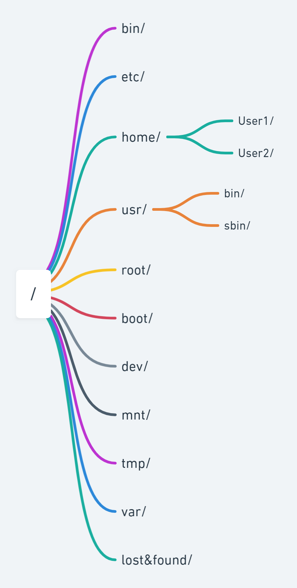

# Linux 基础常识

## 1. Directory of Linux

常用目录的主要功能如下：

- /bin 系统的常用命令如 ls 等存放位置
- /etc 系统配置文件
- /home 除 root 外所有用户的家目录
- /usr/bin 应用程序，所有用户均可以访问
- /usr/sbin 应用程序，只有 root 可以 访问
- boot/ 系统启动相关文件
- dev/ 系统硬件
- mnt/ 临时挂载目录
- tmp/ 存放各类临时文件
- var/ 存放运行时需要改变的数据文件
- lost&found/ 平时为空，非正常关机后的文件会存放在这里

## 2.VMWare配置

| 操作               | 说明               |
|:----------------:|:----------------:|
| ifconfig eth0 ip | 配置 ip 地址         |
| VMnet 1          | localhost 本机通信网卡 |
| VMnet 8          | net 通信网卡         |

应根据选择的联网方式和对应网卡的 ip 地址重设虚拟机 ip 与本机在同一频段方可远程连接通信
