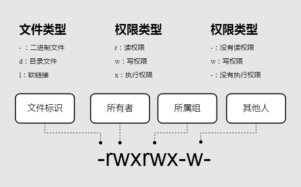

# Linux 常用命令

## 1. 文件处理命令

### ls

`ls` + 选项 + 文件或目录名

| 选项   | 英文原意     | 解释                 |
| ---- | -------- | ------------------ |
| `-a` | all      | 完整选项               |
| `-l` | long     | 详细信息               |
| `-h` | human    | 人性化显示文件大小 MB       |
| `-d` | direct   | 显示目录的纤细信息，但不显示下包文件 |
| `-i` | identity | 查询文件id (Inode)     |

- 输出说明：

### mkdir

`mkdir` + 选项 + 目录名

| 选项   | 作用                         |
| ---- | -------------------------- |
| `-p` | 递归创建目录，连续创建多条，也可空格分隔创建多条目录 |

### cd & pwd

`cd` + 目录名    #come into directory

`pwd`    #print work directory

- `.`    #present directory

- `..`    #last directory

