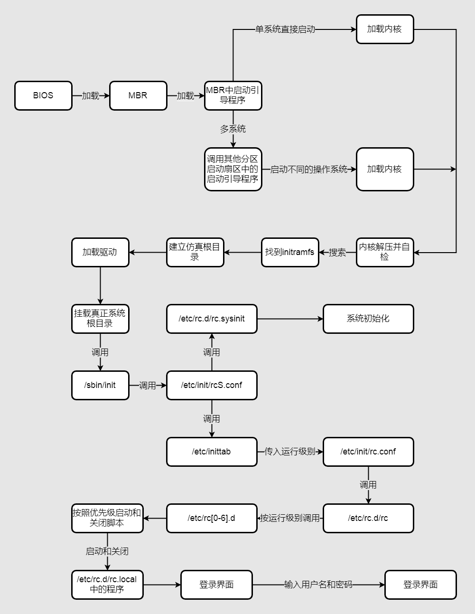

# 启动管理

## 1. CentOS 6.x 启动管理

### 系统运行级别

查看运行级别：

- `runlevel`

改变运行级别

- `init` + 运行级别

| 系统运行级别 | 说明                                         |
| ------ | ------------------------------------------ |
| 0      | **关机**                                     |
| 1      | 单用户模式，类似于安全模式，主要用于系统修复                     |
| 2      | 不完全多用户模式，不含 NFS 服务(net file system 网络文件系统) |
| 3      | 完全多用户模式，标准的字符界面                            |
| 4      | 未分配                                        |
| 5      | 图形界面                                       |
| 6      | **重启**                                     |

 系统默认运行级别

- `/etc/inittab`    #修改该文件可以修改系统启动时进入的默认级别

### 系统启动过程

启动顺序



initramfs内存文件系统

- CentOS 6.x 中使用 initramfs 内存文件系统取代了 CentOS 5.x 中的 initrd RAM Disk，他们的作用类似，可以通过启动引导程序加载到内存中，然后加载启动过程中所需要的内核模块，比如 USB，SATA，SCSI硬盘的驱动和 LVM，RAID 文件系统的驱动

调用`/etc/init/rcS.conf` 配置文件

- 主要功能有两个：
  
  - 先调用`/etc/rc.d/rc.sysinit` 然后由`/etc/rc.d/rc/sysinit` 配置文件进行 linux 系统初始化
  
  - 然后再调用`/etc/inittab`，然后由`/etc/inittab` 配置文件确定系统的默认运行级别

由`/etc/rc.d/rc.sysinit` 初始化

- 获得网络环境

- 挂载设备

- 开机启动画面 Plymouth

- 判断是否启用 SELinux

- 显示于开机过程中的欢迎画面

- 初始化硬件

- 用户自定义模块的加载

- 配置内核的参数

- 设置主机名

- 同步储存器

- 设备映射器及相关初始化

- 初始化软件磁盘阵列（RAID）

- 初始化 LVM 的文件系统功能

- 检验磁盘文件系统（fsck）

- 设置磁盘配额（quota）

- 重新以可读写模式挂载系统磁盘

- 更新quota

- 启动系统虚拟随机数生成器

- 配置机器

- 清除开机过程当中的临时文件

- 创建 ICE 目录

- 启动交换分区（swap）

- 将开机信息写入`/var/log/dmesg`文件中

## 2. 启动引导程序grub

grub 中 分区表示

| 硬盘        | 分区      | Linux中设备文件名 | Grub中设备文件名 |
| --------- | ------- | ----------- | ---------- |
| 第一块SCSI硬盘 | 第一主分区   | `/dev/sda1` | hd(0,0)    |
|           | 第二主分区   | `/dev/sda2` | hd(0,1)    |
|           | 扩展分区    | `/dev/sda3` | hd(0,2)    |
|           | 第一个逻辑分区 | `/dev/sda5` | hd(0,4)    |
| 第二块SCSI硬盘 | 第一主分区   | `/dev/sdb1` | hd(1,0)    |
|           | 第二主分区   | `/dev/sdb2` | hd(1,1)    |
|           | 扩展分区    | `/dev/sdb3` | hd(1,2)    |
|           | 第一个逻辑分区 | `/dev/sdb5` | hd(1,4)    |

grub 配置文件 `/boot/grub/grub.conf`

```bash
default=0    #默认启动第一个系统
timtout=5    #等待时间，默认是5s
splashimage=(hd0,0)/grub/splash.xpm.gz    #这里是制定grub
启动时的背景图像文件的保存位置
hiddenmenu    #隐藏菜单
title CentOS(2.6.32-279.el6.i686)    #title就是标题的意思
    root(hd0,0)    #是指启动程序的保存分区
    kernel    #定义内核加载时的选项
    initrd /initramfs-2.6.32-279.el6.i686.img    #指定了initramfs内存文件系统镜像文件的位置
```
