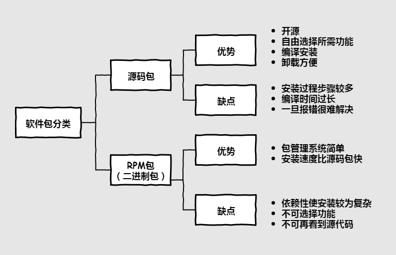

# Linux 软件安装

## 1. 软件包类型

## 2. RPM包管理

### 2.1 rpm命令管理方式

rpm包命名规则

- eg：`httpd-2.2.15-15.el6.centos.1.i686.rpm`    #包全名

| 字段           | 含义                      |
| ------------ | ----------------------- |
| `http`       | 软件包名                    |
| `2.2.15`     | 软件版本                    |
| `15`         | 软件发布次数                  |
| `el6.centos` | 适合的 linux 平台            |
| `i686`       | 适合的硬件平台 noarch任何硬件都可以安装 |
| `rpm`        | rpm 包扩展名                |

安装 RPM 包

- `rpm` + 选项 + 包全名

| 选项        | 作用                     |
| --------- | ---------------------- |
| `-ivh`    | 最常用的安装命令               |
| `-Uvh`    | 最常用的升级命令               |
| `-i`      | 安装 install             |
| `-v`      | 显示详细信息 version         |
| `-h`      | 显示进度 hash              |
| `-e`      | 卸载 erase               |
| `-nodeps` | 不检查依赖性 no depends 一般不用 |

已安装的 RPM 包查询

- `rpm -q` + 包名    #query查询 路径：`/var/lib/rpm`

- `rpm -qi` + 包名    #`-i` 查询软件信息 information；`-p` 查询未安装包信息 package

- `rpm -ql` + 包名    #`-l` 查询软件包安装位置 list；`-p` 查询未安装包信息 package

- `rpm -qf` + 系统文件名    #`-f` 查询系统文件属于哪个软件包 file

- `rpm -qR` + 包名    #`-R` 查询软件包的依赖性 requires；`-p` 查询未安装包信息 package

RPM 包校验

- 检查 RPM 包的完整可用性

- `rpm -V` + 已安装的包名    #校验指定RPM包中的文件 verify

- 输出解读：如果没问题会输出`........ (文件类型) 文件路径`

| 各位输出内容 | 意义          |
| ------ | ----------- |
| `S`    | 文件大小发生了改变   |
| `M`    | 类型or权限发生了改变 |
| `5`    | 内容发生了改变     |
| `D`    | 设备改变        |
| `L`    | 路径改变        |
| `U`    | 文件所有者改变     |
| `G`    | 文件所属组改变     |
| `T`    | 文件修改时间改变    |

| 文件类型 | 意义                 |
| ---- | ------------------ |
| `c`  | config file 配置文件   |
| `d`  | ducumentation 普通文件 |
| `r`  | readme 描述文件        |
| `g`  | ghost 鬼文件 很少见      |
| `l`  | liscense 授权文件      |

RPM 中文件提取

- 当误操作删除了某一配置文件时，可以从RPM包中提取一个出来覆盖修复原错误

- `rpm2cpio 包全名 | cpio -ivd.文件绝对路径`

- `cpio` + 选项 + 文件名or设备

| 选项   | 作用         |
| ---- | ---------- |
| `-i` | copy in 还原 |
| `-d` | 还原时自动创建目录  |
| `-v` | 显示还原过程     |

### 2.2 rpm包依赖性

- 树形依赖：a -> b -> c

- 环形依赖：a -> b -> c -> a    #abc用一条命令安装即可

- 模块依赖：查询网站    [www.rpmfind.net](http://www.rpmfind.net)

### 2.3 yum在线管理

Redhat收费 CentOS不收费

- `setup` 设置ip地址永久生效

- `vim /etc/sysconfig/network-scripts/ifcfg-eth0`
  
  - 把`ONBOOT='no'`改为`'yes'`    #启动网卡
  
  - `service network restart`    #重启网络服务

- 网络 yum 源更换
  
  - `vim /etc/yum.repos.d/CentOS.Base.repo`
  
  - 配置文件解释

| 字段           | 含义                       |
| ------------ | ------------------------ |
| `[base]`     | 容器名称，一定要放在[]中            |
| `name`       | 容器说明，可以自己随便写             |
| `mirrorlist` | 镜像站点，这可以注释               |
| `baseurl`    | 地址                       |
| `enable`     | 默认为1，生效                  |
| `gpgcheck`   | 如果是1，指RPM数字证书生效，如果是0则不生效 |
| `gpgkey`     | 数字证书的公钥文件保存位置            |

常用命令：

- `yum list`    #查询所有可用的软件包
  
  - `yum search` + 关键字   #搜索服务器上所有和关键字相关的包
  
  - `yum -y install` + 包名    #自动一路yes安装
  
  - `yum -y update` + 包名    #如果不加包名会升级内核
  
  - `yum -y remove` + 包名    #卸载包

- `yum grouplist`    #查询软件组名
  
  - `yum groupinstall` + 软件组名    #安装软件组
  
  - `yum groupremove` + 软件组名    #卸载软件组

安装路径：

- RPM包会自动制定安装位置，而源码包手动安装一般在`/usr/local/`

- RPM包默认安装路径：

| 路径               | 说明          |
| ---------------- | ----------- |
| `/etc`           | 配置文件安装目录    |
| `/usr/bin`       | 可执行文件安装目录   |
| `/usr/lib`       | 程序所用函数库保存位置 |
| `/usr/share/doc` | 基本软件手册保存位置  |
| `/usr/share/man` | 帮助文件保存位置    |

服务管理：

- RPM包安装的服务可以使用系统服务管理命令`service`来管理

- `/etc/rc.d/init.d/httpd start`

- `service http start`    #apache启动

- `service iptable stop`    #关闭服务器；网页存在于`/var/www/html/` 中

`du -sh` + 压缩文件    #查看解压文件都有多大

源码包安装：

- 看Install文件中的步骤执行

- 服务器访问压力很大的时候，源码包经过编译可以更适合于服务器
