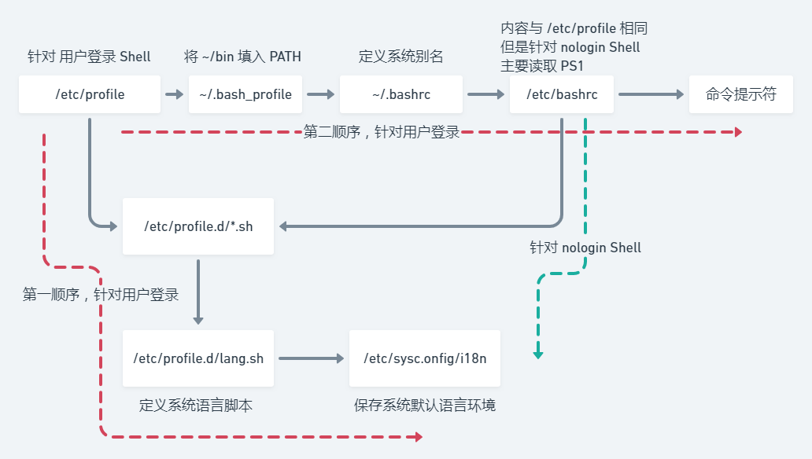

# Shell 编程基础

## 1. 概述

简介：

- shell 是内核的翻译器，是一个与内核交互的界面，Windows 的图形界面就是它的 shell

- shell 是一个功能强大的编程语言，是解释型语言，可以直接调用 Linux 系统命令

分类：

- Bourne Shell：从1979起Unix就开始使用Bourne Shell，其主文件名为 sh

- C Shell：主要用在BSD版Unix系统中，其语法与C语言类似

- 两种主要语法类型完全不兼容，Bourne 家族主要包括sh，ksh，Bash，psh，zsh；C 家族主要包括csh，tcsh

Linux 中支持的 Shell：

- /etc/shells
  
  - sh；bash；tcsh；csh 
  
  - 默认是 bash 

## 2. Shell 脚本的执行方式

echo 输出命令：

- `echo`  + 选项 + “输出内容”
  - -e 支持转椅字符 \ 否则不支持
- 支持颜色输出

| 控制字符  | 作用                                  |
| ----- | ----------------------------------- |
| \\\   | 输出\                                 |
| \a    | 输出警告音                               |
| \b    | Backspace                           |
| \c    | 取消输出行末换行符，与“-n”选项一致                 |
| \e    | Esc                                 |
| \f    | 换页符                                 |
| \n    | 换行符                                 |
| \r    | 回车符                                 |
| \t    | Tab                                 |
| \v    | 垂直制表符                               |
| \0nnn | 按照8进制ASCII码表输出字符。其中0为数字零，nnn是三位八进制数 |
| \xhh  | 按照十六进制ASCII码表输出字符，其中hh是两位十六进制数      |

第一个脚本：

- vi hello.sh

- \#!/bin/Bash 第一行表示调用Bash执行脚本

执行脚本：

- 赋予执行权限，直接`./`运行
  
  - chmod 755 hello.sh
  
  - ./hello.sh

- 通过Bash调用执行脚本，不用执行权限
  
  - bash hello.sh

## 3. Bash 的基本功能

### 3.1 历史命令 & 补全

历史 命令：

- `history` + 选项 + 历史命令保存文件
  
  - -c 清空历史命令
  
  - -w 把缓存中的历史命令写入历史命令保存文件 **~/.bash_history**

- 历史命令默认保存1000条

- 上下箭头调用历史命令

- 使用“！n”重复执行第n条历史命令

- 使用“！！”重复执行上一条命令

- 使用“！字串”重复执行最后一条以该字串开头的命令

补全命令：

- 使用`Tab`键补全命令

### 3.2 别名 & 快捷键

别名：

- `alias` + 别名 + ‘原命令’
  
  - 命令执行的顺序：
    
    1. 用绝对路径或相对路径执行的命令
    
    2. 执行别名
    
    3. 执行 Bash 内部命令
    
    4. 按照 $PATH 环境变量定义的目录查找顺序找到的第一个命令
  
  - 查询别名： `which` + 命令

- 让别名永久生效：修改配置文件 **~/.bashrc**

- 删除别名：`unalias` + 别名

快捷键：

| 快捷键         | 作用                  |
|:----------- | ------------------- |
| `Ctrl` + a  | 把光标移动到命令行开头         |
| `Ctrl` + e  | 把光标移动到命令行结尾         |
| *`Ctrl` + c | 强制终止当前的命令           |
| *`Ctrl` + l | 清屏，相当于 clear 命令     |
| *`Ctrl` + u | 剪切光标之前的命令           |
| `Ctrl` + k  | 剪切光标之后内容            |
| *`Ctrl` + y | 粘贴                  |
| *`Ctrl` + r | 在历史命令中搜索，按下后会出现搜索界面 |
| *`Ctrl` + d | 退出当前终端              |
| `Ctrl` + z  | 暂停并放入后台             |
| `Ctrl` + s  | 暂停屏幕输出              |
| `Ctrl` + q  | 恢复屏幕输出              |

### 3.3 输入输出重定向

标准输入输出：

| 设备  | 设备文件名       | 文件描述符 | 类型     |
| --- | ----------- | ----- | ------ |
| 键盘  | /dev/stdin  | 0     | 标准输入   |
| 显示器 | /dev/sdtout | 1     | 标准输出   |
| 显示器 | /dev/sdterr | 2     | 标准错误输出 |

输出重定向：

- 命令 >/dev/null   将无用的命令输出丢入垃圾箱

| 类型            | 符号                 | 作用                                |
| ------------- | ------------------ | --------------------------------- |
| 标准输出重定向       | 命令 > 文件            | 以**覆盖**的方式，把命令的正确输出输出到指定的文件or设备中  |
| ‘’            | 命令 >> 文件           | 以**追加**的方式，把命令的正确输出输出到指定的文件or设备中  |
| 标准错误输出重定向     | 错误命令 2> 文件         | 以**覆盖**的方式，把命令的错误输出输出到指定文件或设备中    |
| ‘’            | 错误命令 2>> 文件        | 以**追加**的方式，把命令的错误输出输出到指定文件或设备中    |
| 正确输出和错误输出同时保存 | 命令 > 文件 2>&1       | 以**覆盖**的方式，把正确输出和错误输出都保存在同一个文件中   |
| ‘’            | 命令 >> 文件 2>&1      | 以**追加**的方式                        |
| ‘’            | 命令 &> 文件           | 以**覆盖**的方式，把正确输出和错误输出都保存到同一个文件中   |
| ‘’            | 命令 &>> 文件          | 以**追加**的方式                        |
| ‘’            | 命令 >> 文件1  2>> 文件2 | 把正确输出**追加**到文件1中，把错误输出**追加**到文件2中 |

输入重定向：

- `wc` + 选项 + 文件名
  
  - -c 统计字节数
  
  - -w 统计单词数
  
  - -l 统计行数

- `wc` 之后输入一些字符 `Ctrl + d`会统计输出的 “行数，单词数，字符数”

- 命令 < 文件   把文件作为命令的输入
  
  - eg：wc < 某文件  统计某文件信息

### 3.4 多命令顺序执行 & 管道符

多命令顺序执行：

| 多命令执行符 | 格式         | 作用                                      |
| ------ | ---------- | --------------------------------------- |
| ；      | 命令1 ； 命令2  | 多个命令顺序执行，命令之间没有逻辑联系                     |
| &&     | 命令1 && 命令2 | 逻辑与：当命令1正确执行，则命令2才会执行；当命令1执行错误时，命令2不会执行 |
|        |            |                                         |

- eg：`dd` + if=输入设备 + of=输出设备 + bs=字节数 + count=个数
  
  - 参数含义：
    
    - if=输入文件  指定源文件或源设备
    
    - of=输出文件  指定目标文件或目标设备
    
    - bs=字节数  指定一次输入/输出多少字节，即把这些字节看作一个数据块
    
    - count=个数  指定输入/输出多少个数据块

- 作用：进行磁盘复制

- 应用：
  
  - 命令 && echo yes || echo no  判断命令是否正确执行

管道符：

- 命令1 `|` 命令2
  
  - 命令1的正确输出作为命令2的操作对象

- eg：ll -a /etc | less   分屏显示前面命令的输出结果

- `grep` + 选项 + 搜索内容 + 文件名 
  
  - eg：netstat -an | grep ESTABLISHED   显示处于连接状态的用户

### 3.5 通配符 & 其他特殊符号

通配符：

| 通配符 | 作用                                  |
| --- | ----------------------------------- |
| ？   | 匹配任意一个字符                            |
| *   | 匹配任意内容                              |
| []  | 匹配括号中的内容                            |
| [-] | 匹配括号中的任意一个字符                        |
| [^] | 逻辑非，表示匹配除了括号以外的字符：[^0-9] 表示匹配非数字的字符 |

其他特殊符号：

| 符号   | 作用                                                 |
| ---- | -------------------------------------------------- |
| ‘  ’ | 单引号，在单引号中所有的特殊符号都失效                                |
| “  ” | 双引号中 “$”, “`”, 和 “\” 拥有“调用变量的值”；“引用命令”；“转义字符”的特殊含义 |
| \`\` | 反引号，反引号括起来的内容是系统命令，在Bash中会先执行它，和$()相同              |
| $()  | 用来引用系统命令，输出命令结果                                    |
| #    | 在Shell脚本中，用来引用系统命令                                 |
| $    | 用于调用变量的值，后面加变量                                     |
| \    | 转义符                                                |

## 4. Bash 的变量

### 4.1 用户自定义变量

变量的定义：

- 计算机内存的单元

变量设置规则：

- 不可以用数字开头

- 在 Bash 中，变量的默认类型都是字符串类型，如果要进行数值运算，必须将其转为数值型

- 变量以=连接，等号两边不能有空格，如果变量包含空格，需要以引号括起来

- 在变量的值中可以使用“\”转义符

- 如果要增加变量的值，那么可以进行变量值的叠加。不过变量需要用双引号包含“$变量名”或用\${变量名}包含

- 如果是把命令的结果作为变量值赋予变量，则需要使用$()包含命令

- 环境变量名习惯大写便于区分

变量的分类：

- 用户自定义变量

- 环境变量：
  
  - 保存和系统操作环境相关的数据

- 位置参数变量：
  
  - 这种变量主要是用来向脚本当中传递参数或数据的，变量名不能自定义，变量作用是固定的

- 预定义变量：
  
  - 是 Bash 中已经定义好的变量，变量名不能自定义，变量作用也是固定的

本地变量：

- 变量定义
  
  - name="mr car"

- 变量叠加
  
  - name=mr
  
  - name="$mr"car

- 变量的调用
  
  - echo $name

- 变量的查看（所有变量）
  
  - set

- 变量的删除
  
  - unset name

### 4.2 环境变量

环境变量定义：

- 用户自定义变量只在当前的Shell中生效，而环境变量会在当前Shell和这个Shell的所有子Shell当中生效。如果把环境变量写入相应的配置文件，那么这个环境变量就会在所有的Shell中生效

设置环境变量

- export 变量名=变量值 #声明变量

- env #查询变量

- unset 变量名 #删除变量

- `pstree`查询当前的进程，可以看当前使用的Bash是什么

**系统常见环境变量**

- PATH：系统查找命令路径
  
  - PATH="$PATH":/root  #向PATH中添加路径

`PS1`：定义系统提示符的变量

| 提示符 | 含义                        |
| --- | ------------------------- |
| \d  | 显示日期，格式“星期 月 日”           |
| \h  | 显示简写主机名，如默认主机名“localhost” |
| \t  | 显示24h时间，格式为“HH：MM：SS”     |
| \T  | 显示12h时间，格式为“HH：MM：SS”     |
| \A  | 显示24h时间，格式为“HH：MM”        |
| \u  | 显示当前用户名                   |
| \w  | 显示当前所在目录的完整名称             |
| \W  | 显示当前所在目录的最后一个目录           |
| \\# | 执行的第几个命令                  |
| \\$ | 提示符，root用户是#，其他用户显示$      |

- 举例：
  
  - PS1=‘[\u@\t \w]\$ ’   #显示`[root@localhost~]# `

### 4.3 位置参数变量

| 位置参数变量 | 作用                                                      |
| ------ | ------------------------------------------------------- |
| $n     | n为数字，\$0代表命令本身，\$1-\$9表示第一到第九个参数，九个以上的参数需要用{}包含，如\${10} |
| $\*    | 这个变量代表命令行中的所有的参数，\$\*把所有参数看成一个整体，传参是整体的                 |
| $@     | 这个变量代表命令行中的所有的参数，不过\$@把所有参数区别对待，传参是独立的                  |
| $#     | 这个变量代表所有参量的个数                                           |

### 4.4 预定义变量

| 预定义变量 | 作用                                                          |
| ----- | ----------------------------------------------------------- |
| $?    | 最后一次执行的命令的返回状态，如果这个变量的值为0，证明上一个命令正确执行；如果变量值非0，则证明上一个命令执行不正确 |
| $$    | 当前进程的进程号（PID）                                               |
| $!    | 后台运行的最后一个进程的进程号（PID）                                        |

接收键盘输入

- `read` + 选项 + 变量名
  - -p "提示信息"   #在等待read输入时，输出提示信息read命令会一直等待用户输入，使用此选项可以制定等待时间
  
  - -t 秒数   #read命令会一直等待用户输入，使用此选项可以制定等待时间
  
  - -n 字符数    #read命令只接受制定的字符数，就会执行
  
  - -s 隐藏输入的数据，适用于机密信息的输入

## 5. Bash 的运算符

### 5.1 数值运算 & 运算符

数值运算：

- `declare` 声明变量类型
  
  - `declare` + [+-] + 选项 变量名
    - \- 给变量设定类型属性
    
    - \+ 取消变量的类型属性
      
      - i 将变量声明为integer
      
      - x 将变量声明为环境变量
      
      - p 显示指定变量的被声明类型

- 数值运算方法1：
  
  - aa=11
  
  - bb=22
  
  - declare -i cc=\$aa+\$bb

- 数值运算方法2：
  
  - `cc=$(expr $aa + $bb)`  #“+”号左右两侧必须有空格

- 数值运算方法3：
  
  - `$((运算式))`或`$[运算式]`
  
  - `dd=$(($aa+$bb))`
  
  - `dd=$[$aa+$bb]`

- 运算符

| 优先级 | 运算符            | 备注                |
| --- | -------------- | ----------------- |
| 13  | \-, +          | 正负                |
| 12  | !, ~           | 逻辑非，按位取反或补码       |
| 11  | *, /, %        | 乘，除，取模            |
| 10  | +, -           | 加，减               |
| 9   | <<, >>         | 按位左移，右移           |
| 8   | < =, > =, <, > | 小于或等于，大于或等于，小于，大于 |
| 7   | ==, !=         | 判断等于，不等于          |
| 6   | &              | 按位与               |
| 5   | ^              | 按位异或              |
| 4   |                |                   |
| 3   | &&             | 逻辑与               |
| 2   |                |                   |
| 1   | =              | 赋值，运算且赋值          |

### 5.2 变量测试与内容替换

| 变量置换方式       | 变量y没有设置           | 变量y为空值           | 变量y设置值      |
| ------------ | ----------------- | ---------------- | ----------- |
| x=${y-new}   | x=new             | x is null        | x=$y        |
| x=${y:-new}  | x=new             | x=new            | x=$y        |
| x=${y+new}   | x is null         | x=new            | x=new       |
| x=${y:+new}  | x is null         | x is null        | x=new       |
| x=${y=new}   | x=new y=new       | x is null y is y | x=$y y is y |
| x=${y:=new}  | x=new y=new       | x=new y=new      | x=$y y is y |
| x=${y?new}   | 新值输出到标准错误输出(就是屏幕) | x is null        | x=$yx=$y    |
| x=\${y:?new} | 新值输出到标准错误输出       | 新值输出到标准错误输出      | x=$y        |

## 6. 环境变量配置文件

### 6.1 环境变量配置文件简介

`source` 配置文件

`.` 配置文件

- 两条命令的作用是让环境变量的配置文件立即生效，正常是重启生效

- 配置文件：
  
  - /etc/profile
  
  - /etc/profile.d/*.sh
  
  - ~/.bash_profile
  
  - ~/.bashrc
  
  - /etc/bashrc

- 环境变量的配置文件中主要是定义对系统的操作环境生效的系统默认环境变量，比如PATH，HISTSIZE，PS1，HOSTNAME等默认环境变量。

### 6.2 环境变量配置文件作用

配置文件调用顺序：

- etc/profile 的作用：
  - USER 变量：
  
  - LOGNAME变量：
  
  - MAIL 变量
  
  - PATH 变量
  
  - HOSTNAME 变量
  
  - HISTSIZE 变量
  
  - umask
  
  - 调用 /etc/profile.d/*.sh 文件

### 6.3 其他配置文件和登陆信息

注销时生效的环境变量配置文件：

- ~/.bash_logout

其他配置文件：

- ~/bash_history  #所有 history 保存的命令

Shell 登陆信息

- 本地终端欢迎信息：
  
  - /etc/issue

| 转义符 | 作用                    |
| --- | --------------------- |
| \d  | 显示当前系统日期              |
| \s  | 显示操作系统名称              |
| \l  | 显示登陆的终端号，有用           |
| \m  | 显示硬件体系结构，如 i386，i686等 |
| \n  | 显示主机名                 |
| \o  | 显示域名                  |
| \r  | 显示内核版本                |
| \t  | 显示当前系统时间              |
| \u  | 显示当前登录用户序列号           |

- 远程终端欢迎信息：
  
  - /etc/issue.net
  
  - 转义符在 /etc/issue.net 文件中不能使用
  
  - 是否显示此欢迎信息，由ssh的配置文件/etc/ssh/sshd_config决定，加入“Banner /etc/issue.net”行才能显示（记得重启 SSH 服务）
